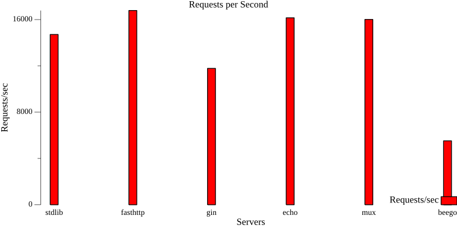

# HTTP Server Performance Comparison

This repository contains a performance comparison of different HTTP servers written in Go. Currently, it includes the following implementations:

- **`fasthttp`**: A high-performance HTTP package designed to be fast and efficient.
- **`stdlib`**: Standard library of `net/http`.
- **`gin`**
- **`echo`*
- **`mux`**
- **`beego`**




## Project Structure

```
go-http-benchmark/
│
|-servers
    ├── fasthttp/           # FastHTTP server implementation
        └── main.go         # Code for the fasthttp server

    ├── stdlib/             # Stdlib server implementation
        └── main.go         # Code for the stdlib server
│
├── docker-compose.yml      # Docker Compose configuration for running the servers
├── Dockerfile              # Dockerfile to build the servers' Docker images
└── README.md               # This file
```

## How to Build and Run

### 1. Prerequisites

Ensure you have the following tools installed:

- **Docker**: For building and running containers.
  - [Install Docker](https://docs.docker.com/get-docker/)
  
- **Docker Compose**: For orchestrating multi-container applications.
  - [Install Docker Compose](https://docs.docker.com/compose/install/)
  
- **Go**: To build and run the servers manually (if not using Docker).
  - [Install Go](https://golang.org/doc/install)

### 2. Build and Run with Docker Compose

If you prefer to use Docker, this is the easiest way to build and run both HTTP servers.

#### Steps:

1. Clone the repository:

    ```bash
    git clone <repository_url>
    cd go-http-benchmark
    ```

2. Build the Docker images:

    ```bash
    docker-compose build
    ```

3. Start the servers:

    ```bash
    docker-compose up
    ```

Once the servers are running, they will be accessible at the following URLs:

- **`fasthttp`** server: [http://localhost:8082](http://localhost:8082)
- **`stdlib`** server: [http://localhost:8081](http://localhost:8081)

You can visit these URLs in your browser or use `curl` to test the endpoints.

### 3. Build and Run Locally (Without Docker)

If you'd like to run the servers without Docker, follow these instructions.

#### **For `fasthttp`**:

1. Navigate to the `fasthttp` folder:

    ```bash
    cd fasthttp
    ```

2. Install the required dependencies:

    ```bash
    go get github.com/valyala/fasthttp
    ```

3. Run the server:

    ```bash
    go run main.go
    ```

The server will be available at [http://localhost:8080](http://localhost:8080).

#### **For `stdlib`**:

1. Navigate to the `stdlib` folder:

    ```bash
    cd stdlib
    ```

2. Run the server:

    ```bash
    go run main.go
    ```

The server will be available at [http://localhost:8080](http://localhost:8080).

## Performance Comparison

Both `fasthttp` and `stdlib` are designed to handle HTTP requests efficiently, but they have different approaches and performance characteristics. This project compares their performance under load.

### How to Perform Load Testing

To benchmark the performance of each server, you can use `wrk`, a modern HTTP benchmarking tool.

#### Install `wrk`

Install `wrk` using Homebrew:

```bash
brew install wrk
```

#### Example load testing:

Run the following command to benchmark the **`fasthttp`** server:

```bash
wrk -t12 -c400 -d30s http://localhost:8080
```

This will perform a load test for 30 seconds with 12 threads and 400 connections. It will output the performance results, including the number of requests per second, latency, and more.

## License

This project is licensed under the **MIT License**. See the [LICENSE](LICENSE) file for more details.
